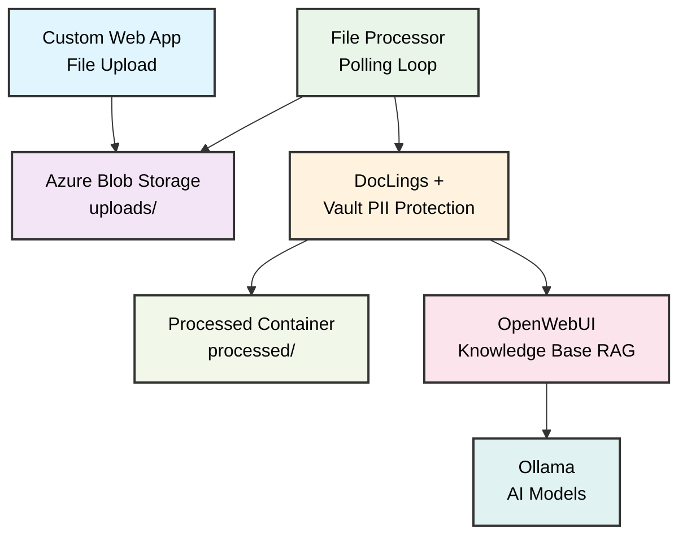

# AI pipeline demo

This demo demonstrates how to build a complete AI document processing system using Azure Infrastructure, HashiCorp Nomad for container orchestration, HashiCorp Vault for PII protection and secrets management, Ollama for local AI model inference, OpenWebUI for AI chat interface, DocLings for advanced document processing. The system creates a full-stack AI pipeline that can be deployed in under 30 minutes.

## Architecture

The system operates through a series of connected steps. Users upload documents through a custom web app. Files are stored in Azure Blob Storage, which the file processor monitors continuously. The processor converts documents to markdown using DocLings, applies PII protection through Vault, and then stores the protected version in the processed container. The protected version also gets uploaded to OpenWebUI for knowledge base integration. Users can then interact with their documents through the AI interface powered by Ollama.

### Virtual File Handling

The file-processor includes enhanced capabilities for handling virtual files and directory structures in Azure Blob Storage:

- **Virtual Directories**: Supports hierarchical folder structures created by blob names with forward slashes
- **Automatic Detection**: Automatically detects and processes virtual file structures
- **Knowledge Base Organization**: Automatically creates and organizes knowledge bases based on virtual paths
- **Efficient Processing**: Handles files at multiple levels of nesting efficiently

This enables organized storage patterns like:
```
uploads/
├── documents/contracts/contract1.pdf
├── reports/annual_report.pdf
└── data/sales_data.csv
```

The processor automatically creates appropriate knowledge bases for each document category while maintaining efficient processing.

### Knowledge Base Organization

The system automatically creates and organizes knowledge bases based on virtual directory structure:

- **Automatic Categorization**: Files are automatically organized into knowledge bases based on their virtual path
- **Pre-defined Categories**: Common document types (contracts, reports, invoices, etc.) get dedicated knowledge bases
- **Custom Categories**: Any directory name automatically gets its own knowledge base
- **Intelligent Organization**: Related documents are grouped together for better search and retrieval

**Example Organization:**
- `uploads/contracts/contract1.pdf` → "Contracts Documents" knowledge base
- `uploads/reports/annual_report.pdf` → "Reports Documents" knowledge base
- `uploads/invoices/invoice1.pdf` → "Invoices Documents" knowledge base

This provides automatic document organization without manual categorization, making the system scalable and maintainable.



### Infrastructure components

The infrastructure runs on Azure with a resource group that isolates your demo environment. A virtual network provides segmented subnets for servers, private clients, and public clients, each with network security groups for port-specific access control. VMs run Ubuntu 22.04 LTS with Nomad pre-configured, and four blob storage containers handle uploads, processed files, knowledge base, and Nomad data. Everything uses managed identity for secure access.

Vault runs as a 1-node cluster with Raft storage and automatically unseals using the `vault-unsealer` service. It integrates with Nomad using JWT authentication for workload identities, provides centralized secret management, and handles PII detection and tokenization. You can use either the Enterprise Transform Engine or Open Source KV-based approach for data protection.

The Nomad setup includes one server node to manage everything, one private client node for internal services like Ollama and the file processor, and one public client node for external services like OpenWebUI and the web upload app. This provides clean separation of concerns without unnecessary complexity.

### Application services

Ollama runs locally for AI model inference, supporting models like `granite3.2-vision`. OpenWebUI provides the AI chat interface with knowledge base integration. The `file-processor` uses DocLings for document processing and integrates with Vault for PII protection. The web upload app gives users a clean interface to upload files.

## Prerequisites and setup

You need Azure CLI for Azure management, Terraform for infrastructure as code, Nomad CLI for cluster management, Docker for building application images, and an SSH key for VM access. Ensure you have an active Azure subscription with billing enabled and sufficient VM and storage quotas. Your local machine needs at least 8GB RAM, 10GB free storage, and a reliable internet connection. The demo works on macOS, Linux, or Windows.

## Quickstart

Navigate to the project directory, configure Azure authentication with `az login`, set your subscription, then run Terraform from the infrastructure directory to create all the Azure resources.

```bash
cd ai-pipeline-nomad-vault
az login
az account set --subscription <your-subscription-id>
cd infrastructure
terraform init
terraform plan
terraform apply
```

Deploy Vault to handle your secrets and PII protection by running Terraform from the vault directory.

```bash
cd ../vault
terraform init
terraform plan
terraform apply
```

Deploy all demo applications using the deployment script, then run the demo script to see your pipeline in action.

```bash
cd ..
./scripts/deploy-demo.sh
./scripts/demo.sh
```

## Project organization and troubleshooting

The project organizes into logical sections: infrastructure directory contains Terraform files for Azure resources, jobs directory has Nomad job specifications for each service, applications directory contains source code for the web upload app and file processor, and scripts handle deployment, demo workflows, and cleanup.

VM boot issues usually stem from custom data scripts or network connectivity problems. Service startup issues often relate to health checks or resource constraints. Network connectivity problems typically involve security group rules or subnet configuration.

Use these commands to troubleshoot issues:

```bash
nomad server members
nomad alloc logs <allocation-id>
curl http://<service-ip>:<port>/health
az resource list --resource-group <rg-name>
az storage blob list --account-name <storage-account> --container-name uploads
```